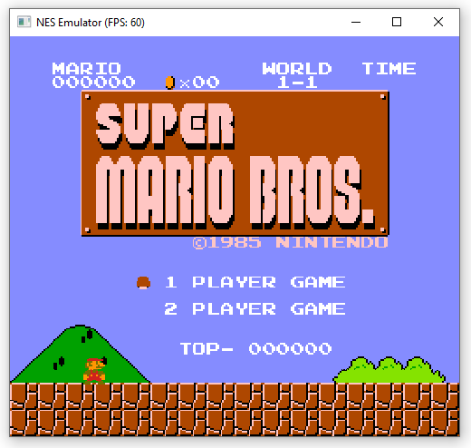
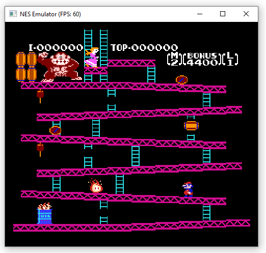

# NES Emulator

## Overview

This is a NES emulator written in C/C++ using Windows API with no external dependencies. It uses GDI for graphics rendering and WinMM (legacy Windows Multimedia API) for audio output.

This is obviously not a new concept - the first NES emulator was written in the 1990s. This is just a side-project that was built by referencing old spec-sheet files in .txt format found across the internet.

## Usage

To start the emulator:

`NES.exe [-pal] [-ntsc] <rom_file_path>`

Default input keys:
| Button  | Mapped Key   |
|---------|--------------|
| UP      | ↑            |
| DOWN    | ↓            |
| LEFT    | ←            |
| RIGHT   | →            |
| A       | A            |
| B       | X            |
| START   | Enter        |
| SELECT  | Space        |

## CPU (6502)

The 8-bit 6502 CPU emulation is cycle-accurate, and is implemented as a state machine. Due to the abundance of information available online, this was the easiest part of the project.

It also supports undocumented instructions, excluding the unstable ones.

## PPU (Graphics Rendering)

The PPU was perhaps the most difficult part of the emulator. It is not inherently complex, but it has a lot of unusual quirks due to constraints of the original hardware (such as dual-purpose internal registers) which must be emulated accurately to ensure correct behaviour.

The PPU consists of two parts: background and sprites. Background rendering is cycle-accurate, which is important for many games. Sprite rendering is implemented slightly differently than the original hardware, but this is generally not critical for accuracy.

Graphics are rendered using the basic Win32 GDI API. GDI does not support VSync, but the `DwmFlush` function can be used to sync the frame rate with the screen refresh rate. This helps to reduce screen tearing and makes animations smoother, especially for PAL games designed to run at 50Hz. If `DwmFlush` is unavailable, the emulator falls back to a less accurate timer-based refresh rate.

## APU (Audio Processing)

The APU emulation supports all five NES audio channels: two square wave generators, a triangle wave generator, a random noise channel, and a delta modulation channel (DMC) for raw PCM playback.

The native sample-rate of the NES is 1.79MHz (NTSC), or in other words, 1 sample per CPU cycle. This is not suitable for PC sound-card output.

Instead of down-sampling the native 1.79MHz samples, the emulator calculates the target frequencies and generates equivalent output samples at 48,000Hz. The only exception to this is the DMC channel, which was used by games to play raw PCM samples. In this case, it is necessary to generate the original samples at the native sample-rate before down-sampling them to 48,000Hz for output.

The emulator generates raw PCM samples for each channel type, mixes them, and then queues them for playback via the Windows Multimedia API (`waveOutWrite`).

## Region Support

The emulator supports both NTSC (60Hz) and PAL (50Hz) ROMs.

As the standard NES ROM file header does not specify the target region mode, it must be specified via command-line options (`-ntsc` or `-pal`). The default setting is NTSC.

## Mappers

NES cartridges often contained additional hardware called mappers, which extended the system's capabilities beyond the base hardware. These mappers were used for memory bank-switching, advanced graphics features, and other enhancements.

As mappers are game-specific and not part of the original NES hardware, they are not supported at this time. The emulator focuses on base NES functionality without mapper extensions.

## Screenshots

